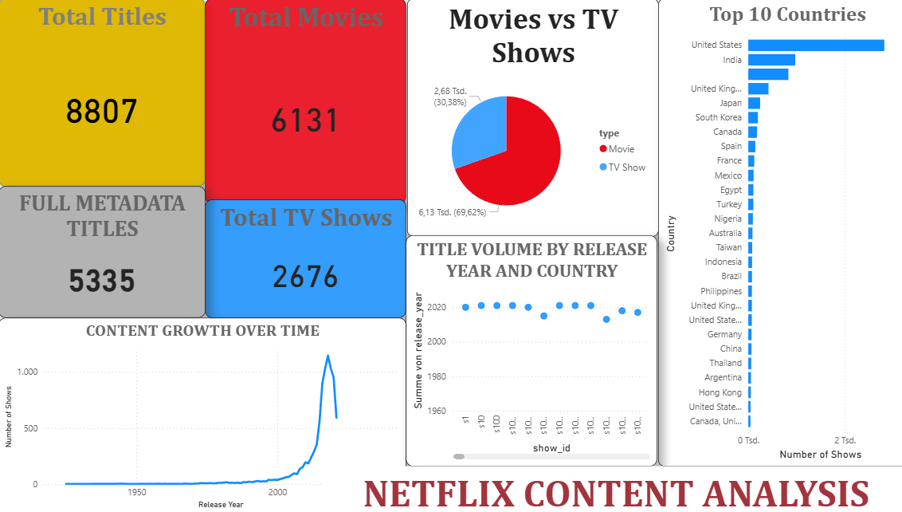

# Netflix Data Engineering Analysis

A comprehensive Data Engineering project analyzing Netflix content metrics using Python, SQL, and Power BI. This project demonstrates end-to-end data pipeline capabilities including data cleaning, quality assessment, business intelligence reporting, and interactive dashboard creation.

## What do we do?

We analyze Netflix data and find out:
- **Data Quality**: Which titles have incomplete information?
- **Business Insights**: TOP 10 countries, genre distribution, rating analyses
- **Improvement Potential**: Where can we increase data quality?

**Why this structure?**
- **Python**: Data cleaning and quality checks
- **SQL**: Business reports and analyses
- **Power BI**: Professional visualization
- **No redundancy** - each tool has its clear task!

## Requirements

- **Python** (pandas, matplotlib)
- **SQL** (basic queries)
- **Power BI** (optional)

## Project Structure

```
.
├── 01_python_data_cleaning.py          # START HERE! Data cleaning
├── data/
│   ├── netflix_titles.csv              # Netflix data (from Kaggle)
│   └── processed/                      # Cleaned data (will be created)
├── sql/
│   └── business_reports.sql            # Step 2: Business reports
├── dashboards/
│   └── POWER_BI_SETUP.md               # Step 3: Power BI guide
├── src/
│   └── requirements.txt                # Python packages
├── PROJECT_WORKFLOW.md                 # Detailed guide
└── README.md                           # This file
```

That's all! No unnecessary code. Only what's needed.

## Quick Start - Step by Step

### Step 1: Installation

```bash
# Install Python packages
pip install -r src/requirements.txt
```

### Step 2: Prepare data

1. Download Netflix dataset from [Kaggle](https://www.kaggle.com/datasets/shivamb/netflix-shows)
2. Save as `data/netflix_titles.csv`

### Step 3: Python - Data Cleaning START HERE!

**Simplest method (recommended):**
```bash
python 01_python_data_cleaning.py
```

**What happens?**
- Loads raw data
- Cleans data (missing values, duplicates, etc.)
- Creates data quality report
- Exports cleaned data for SQL

**Result:**
- `data/processed/netflix_cleaned.csv` (for SQL and Power BI)
- `data/processed/data_quality_report.json` (Quality statistics)
- `data/processed/missing_values_visualization.png` (Chart)

### Step 4: SQL - Business Reports

Open `sql/business_reports.sql` in your SQL editor and execute the queries.

**What do the SQL queries do?**
- TOP 10 countries by content count
- Genre distribution
- Rating analysis (Movie vs TV Show)
- Content statistics over the years

**Tip:** The data has already been cleaned by Python!

### Step 5: Power BI - Dashboard (optional)

See the detailed Power BI Dashboard guide below or follow the instructions in `dashboards/POWER_BI_SETUP.md`.  
Import `data/processed/netflix_cleaned.csv` into Power BI.

## Clear Division of Work

### Python (Data Cleaning)
- Load and validate data
- Identify missing values
- Remove duplicates
- Data quality checks
- Export cleaned data

### SQL (Business Reports)
- TOP lists (countries, genres, etc.)
- Aggregations and statistics
- Comparisons (Movie vs TV Show)
- Time-based analyses

### Power BI (Visualization)
- Import cleaned data
- Interactive dashboards
- Professional charts
- Business Intelligence reports

## What do we learn?

### Python
- Load data with Pandas
- Data cleaning and validation
- Data quality checks
- Export CSV

### SQL (Basics)
- SELECT statements
- WHERE conditions
- COUNT, GROUP BY, ORDER BY
- Aggregations

### Power BI
- Import data
- Create visualizations
- Dashboard design
- Business reports

## Example Results

### Data Quality (Python)
```
All titles:              8,800
With complete data:     3,200 (36%)
Missing metadata:       5,600 (64%)
```

### Business Report (SQL)
```
TOP 3 Countries:
1. United States: 2,815 titles
2. India:         942 titles
3. United Kingdom: 420 titles
```

## Project Structure

- Clean, professional code structure
- Clear separation of concerns (Python for cleaning, SQL for analysis)
- Production-ready data pipeline

## Next Steps

1. **START:** Run `01_python_data_cleaning.py`
2. Test the SQL reports (`sql/business_reports.sql`)
3. Create Power BI Dashboard (optional)
4. Present your results!

**See also:** `docs/SETUP_GUIDE.md` for setup instructions

## Why This Structure?

**Problem before:**
- Python and SQL did the same thing (redundant)
- "Funnel" didn't fit metadata analysis
- No clear division of work

**Solution now:**
- Python: Data cleaning (its strength)
- SQL: Business reports (its strength)
- Clear, realistic Data Engineering structure
- Each tool does what it's made for!

## Questions?

Check the documentation or open an issue.

---

## Power BI Dashboard Setup



Complete Guide:

<details>
<summary><b>Show Power BI Dashboard Guide</b></summary>

# Power BI Dashboard Guide - Netflix Content Analysis

This guide is based on the final dashboard with all visuals.

## Dashboard Overview

The dashboard consists of the following visuals:

1. **4 KPI Cards:**
   - Total Titles (8807)
   - Total Movies (6131)
   - FULL METADATA TITLES (5335)
   - Total TV Shows (2676)

2. **Pie Chart:** Movies vs TV Shows

3. **Bar Chart:** Top 10 Countries

4. **Line Chart:** Content Growth Over Time

5. **Scatter Plot:** Title Volume by Release Year and Country

---

## STEP 1: Load Data

1. Open Power BI Desktop
2. Click **"Get Data"** → **"Text/CSV"**
3. Navigate to: `data/processed/netflix_cleaned.csv`
4. Click **"Load"**

**Important:** Always use `netflix_cleaned.csv`, NOT the raw file!

---

## STEP 2: Create KPI Cards

### KPI Card 1: "Total Titles"

1. **Create Card Visual:**
   - Panel "Visualizations" → Click on **"Card"**

2. **Create DAX Measure:**
   - Panel "Data": Right-click on `netflix_cleaned` → **"New measure"**
   - Formula:
     ```dax
     Total Titles = COUNTROWS(netflix_cleaned)
     ```

3. **Add to Card:**
   - Drag "Total Titles" into the Card

4. **Format:**
   - Format → Title: **"Total Titles"**
   - Background color: Yellow (optional)

---

### KPI Card 2: "Total Movies"

1. Create new Card
2. DAX Measure:
   ```dax
   Total Movies = CALCULATE(COUNTROWS(netflix_cleaned), netflix_cleaned[type] = "Movie")
   ```
3. Title: **"Total Movies"**
4. Background color: Red (optional)

---

### KPI Card 3: "FULL METADATA TITLES"

1. Create new Card
2. DAX Measure:
   ```dax
   Full Metadata Titles = 
   CALCULATE(
       COUNTROWS(netflix_cleaned),
       netflix_cleaned[director] <> BLANK(),
       netflix_cleaned[cast] <> BLANK(),
       netflix_cleaned[country] <> BLANK(),
       netflix_cleaned[rating] <> BLANK(),
       netflix_cleaned[description] <> BLANK()
   )
   ```
3. Title: **"FULL METADATA TITLES"** (uppercase)
4. Background color: Gray (optional)

---

### KPI Card 4: "Total TV Shows"

1. Create new Card
2. DAX Measure:
   ```dax
   Total TV Shows = CALCULATE(COUNTROWS(netflix_cleaned), netflix_cleaned[type] = "TV Show")
   ```
3. Title: **"Total TV Shows"**
4. Background color: Blue (optional)

---

## STEP 3: Pie Chart "Movies vs TV Shows"

1. **Create Pie Chart:**
   - Panel "Visualizations" → Click on **"Pie chart"**

2. **Add Data:**
   - **Legend:** Drag `type` into it
   - **Values:** Drag `show_id` into it (as count)

3. **Format:**
   - Format → Title: **"Movies vs TV Shows"**

---

## STEP 4: Bar Chart "Top 10 Countries"

1. **Create Bar Chart:**
   - Panel "Visualizations" → Click on **"Clustered bar chart"**

2. **Add Data:**
   - **Axis (Y-axis):** Drag `country` into it
   - **Values (X-axis):** Drag `show_id` into it (as count)

3. **Show Top 10:**
   - Three dots (...) on chart → **"Sort by"** → `show_id` → **Descending**
   - Three dots again → **"Top N"** → Set to **10**

4. **Format:**
   - Format → Title: **"Top 10 Countries"**

---

## STEP 5: Line Chart "Content Growth Over Time"

1. **Create Line Chart:**
   - Panel "Visualizations" → Click on **"Line chart"**

2. **Add Data:**
   - **Axis (X-axis):** Drag `release_year` into it
   - **Values (Y-axis):** Drag `show_id` into it (as count)
   - **Legend:** Drag `type` into it (for separate lines)

3. **Format:**
   - Format → Title: **"CONTENT GROWTH OVER TIME"** (uppercase)

---

## STEP 6: Scatter Plot "Title Volume by Release Year and Country"

1. **Create Scatter Plot:**
   - Panel "Visualizations" → Click on **"Scatter chart"**

2. **Add Data:**
   - **X-Axis:** Drag `show_id` into it
   - **Y-Axis:** Drag `release_year` into it
   - **Details:** Drag `country` into it (optional, for grouping)

3. **Format:**
   - Format → Title: **"TITLE VOLUME BY RELEASE YEAR AND COUNTRY"**

---

## Layout Arrangement

**Recommended Arrangement (as in dashboard):**

```
┌─────────────────────────────────────────────────────────┐
│  [Card 1]  [Card 2]  [Card 3]  [Card 4]  │  [Pie]     │
├─────────────────────────────────────────────────────────┤
│  [Bar: Countries]     │  [Scatter Plot]                │
├─────────────────────────────────────────────────────────┤
│  [Line Chart: Growth]                                    │
└─────────────────────────────────────────────────────────┘
```

- **Top left:** 4 KPI Cards side by side
- **Top right:** Pie Chart
- **Middle left:** Bar Chart (Countries)
- **Middle right:** Scatter Plot
- **Bottom:** Line Chart (full width)

---

## All DAX Measures (To Copy)

```dax
Total Titles = COUNTROWS(netflix_cleaned)

Total Movies = CALCULATE(COUNTROWS(netflix_cleaned), netflix_cleaned[type] = "Movie")

Total TV Shows = CALCULATE(COUNTROWS(netflix_cleaned), netflix_cleaned[type] = "TV Show")

Full Metadata Titles = 
CALCULATE(
    COUNTROWS(netflix_cleaned),
    netflix_cleaned[director] <> BLANK(),
    netflix_cleaned[cast] <> BLANK(),
    netflix_cleaned[country] <> BLANK(),
    netflix_cleaned[rating] <> BLANK(),
    netflix_cleaned[description] <> BLANK()
)
```

---

## Common Problems & Solutions

### Problem: "First Date: show_id" appears
**Solution:** Use DAX Measures instead of directly using `show_id`!

### Problem: No numbers are displayed
**Solution:** Check if `netflix_cleaned.csv` was loaded and use DAX Measures.

---

**Good luck!**

</details>

---

**Good luck!**
